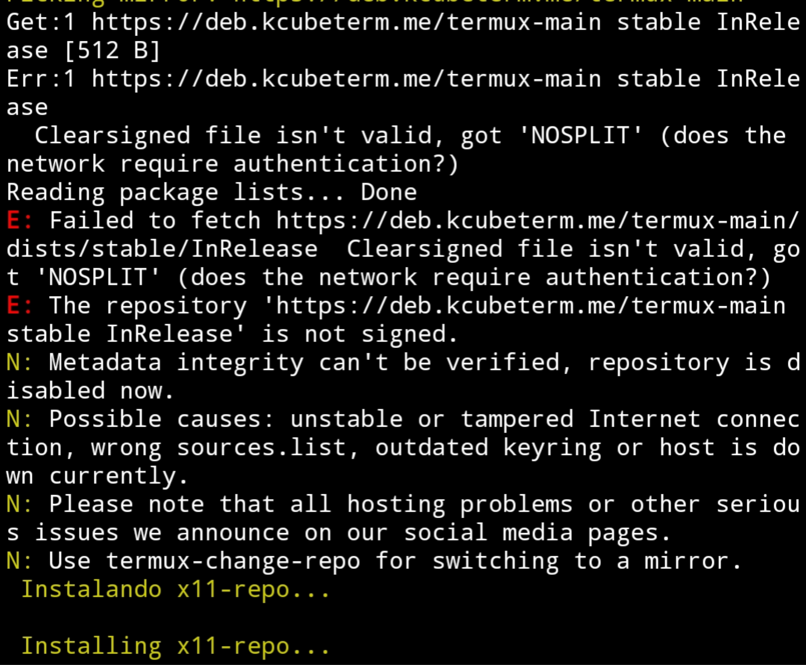
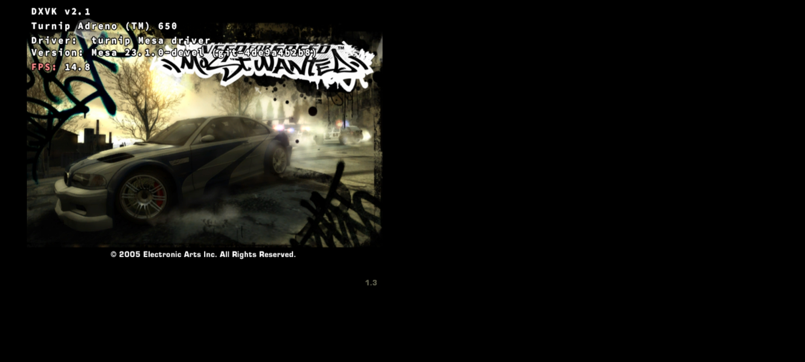
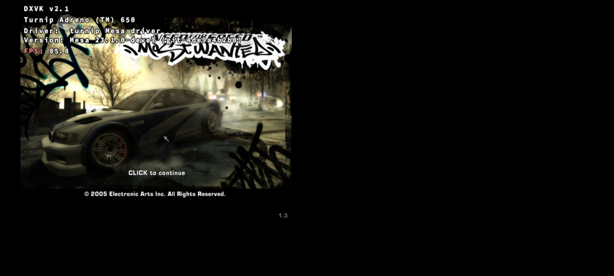
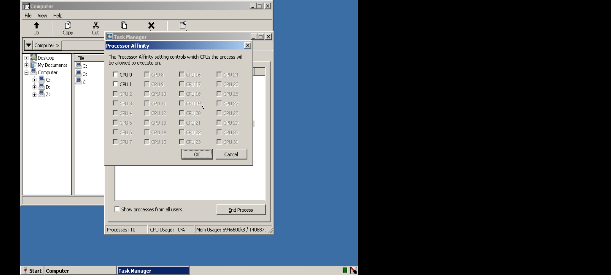

## Para a versão em PT-BR,[clique aqui.](https://github.com/Herick75/Box4Droid/blob/main/READMEPT-BR.md)

# What is Box4Droid?

Box4Droid is a simple script that automates the installation of a preconfigured Rootfs with [Box86](https://github.com/ptitSeb/box86), [Wine 7.1](https://www.winehq.org/) and [DXVK](https://github.com/doitsujin/dxvk) installed, made by me.[YouTube: Smartphone Desktop](https://youtube.com/@smartphonedesktop4229).

# Do you need root?

No, Box4Droid uses proot to run Rootfs, so no, root is not required.

# How to install?  

First you need to install [Termux](https://f-droid.org/en/packages/com.termux) and [Termux-x11](https://github.com/termux/termux-x11/actions/runs/4385798707).  After installing them, just copy the command `curl -o install https://raw.githubusercontent.com/Herick75/Box4Droid/main/Scripts/install && chmod +x install && ./install` and paste it in the Termux terminal and wait until the installation completes.

# How to start Box86 + Wine?

After the installation is completed, you just need to start Termux-x11 by typing `x11` in the terminal, enter the Termux-x11 app, then go back to Termux, and then type `start-box86`, in seconds Wine will start together with the TFM.

You can also use Input Bridge, just run `installer.bat` and Input Bridge will start automatically.

# System requirements 

*Adreno 618+ 

*Android 10+??  

*64-bit Android 

You also need at least 4GB free for the installation to go without problems.

# How to configure?  

You can choose to use environment variables, there are 3 files, `dxvk.conf`, `Box86.conf` and `DXVK_env.conf`. These files are created and found in the internal storage inside the Box4Droid folder right after the first run of Box86.

The `Box86.conf` file is for you to use the Box86 environment variables, see all of them [here](https://github.com/ptitSeb/box86/blob/master/docs/USAGE.md#) .  You can add as many variables as you like. In this file, there is the `res` variable, in it you put the same resolution that you chose in Termux-x11, otherwise the screen content may be cut off or there may be borders on the screen.

The `DXVK_env.conf` file is for you to use the environment variables referring to [DXVK_HUD](https://github.com/doitsujin/dxvk#hud), in addition to other settings.  

The `dxvk.conf` file is for you to use the environment variables referring to [dxvk](https://github.com/doitsujin/dxvk/blob/master/dxvk.conf)(To use it, it is necessary to uncomment the line that exports your directory, this variable is found in `DXVK_env.conf`).

# known issues

For some reason, when you go to install Termux and use the `pkg update -y` command for the first time, it may happen that you get some error and it is not possible to continue the installation, if that happens, just delete the Termux data and try again.

Another problem that happens is when you start Box86 for the first time, when you run anything, it will run extremely slow, in this case, it is highly recommended to restart Box86 (in most cases, games will run perfectly after that).

Before

After

In Wine, processor cores are not available to be selected via `taskmgr`.  GTA IV has infinite loading.  I'm looking for a way around this.

And there are probably other issues, so feel free to open an issue.

# TO-DO list

Install VirGL for Mali GPUs.

Create a launcher.

Box86 and Box64 included.

# Third party applications

[Box86 by ptitseb](https://github.com/ptitSeb/box86) MIT license

[Proot under Termux](https://github.com/termux/proot) GPL-2.0 license

[Anlinux Ubuntu Rootfs](https://github.com/EXALAB/Anlinux-Resources/tree/master/Rootfs/Ubuntu/arm64) GPL-2.0 License

[DXVK](https://github.com/doitsujin/dxvk) Zlib license

[Termux-app](https://github.com/termux/termux-app) GPLv3 license

[Termux-x11](https://github.com/termux/termux-x11)

[Wine](https://wiki.winehq.org/Licensing)
